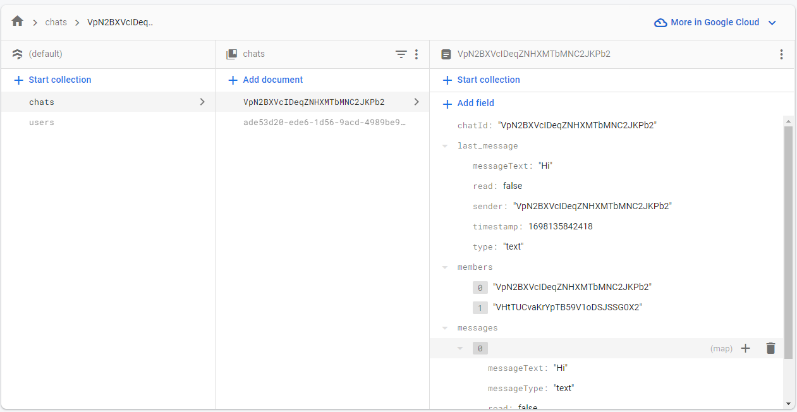
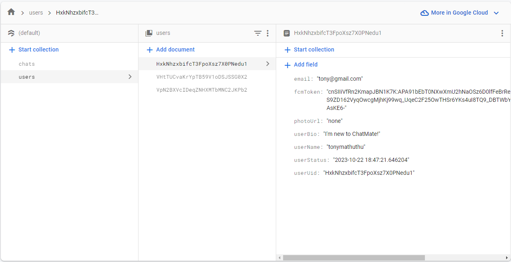

# ChatMate - Messenger 📱📢

ChatMate is an ongoing Flutter-based chat application with Firebase as the backend, designed to bring you a seamless messaging experience. Developed by Karl Mathuthu, ChatMate combines the best features of popular messaging apps like WhatsApp and Messenger, offering you a visually appealing and functional platform.

## Features 🚀

ChatMate - Messenger comes packed with a range of features to enhance your messaging experience:

- **Chatting**: Enjoy real-time messaging with friends and family in a visually pleasing chat bubble design, reminiscent of Facebook Messenger.

- **Notifications**: Stay up to date with instant notifications for new messages and updates.

- **Video & Audio Calls**: Connect with your contacts through high-quality video and audio calls using WebRTC for a crystal-clear conversation.

- **Status Updates**: Share your moments with the world by posting status updates.

- **Call History**: Keep track of your call history and never lose an important conversation.

## Credits 🙌

We would like to extend our gratitude to [Prabhanu Gunaweera](https://github.com/prahack) for his outstanding Chat Bubble library that has added a delightful touch to my app.

## Screenshots and Logo 📸

## Firestore Database Structure 📊

### Collection: `users`

- **Document 1**
  - `userName`: String
  - `userUid`: String
  - `fcmToken`: String
  - `email`: String
  - `photoUrl`: String
  - `userBio`: String
  - `userStatus`: String (Online or Last Seen)

- **Document 2**
  - `userName`: String
  - `userUid`: String
  - `fcmToken`: String
  - `email`: String
  - `photoUrl`: String
  - `userBio`: String
  - `userStatus`: String (Online or Last Seen)

(Repeat the structure for more user documents as needed)

### Collection: `chats`

- **Document 1**
  - `members`: Array of Strings
    - `"first user"`
    - `"second user"`
  - `chatId`: String
  - `last_message`: Map<String, dynamic>
    - `messageText`: String
    - `messageType`: String
    - `read`: Boolean (true if the message is read, false if not)
    - `senderId`: String
    - `timestamp`: Timestamp

- **Document 2**
  - `members`: Array of Strings
    - `"first user"`
    - `"second user"`
  - `chatId`: String
  - `last_message`: Map
    - `messageText`: String
    - `messageType`: String
    - `read`: Boolean (true if the message is read, false if not)
    - `senderId`: String
    - `timestamp`: Timestamp

(Repeat the structure for more chat documents as needed)

This structure represents the Firestore database schema, where you have a collection of `users` containing user information and a collection of `chats` containing chat information, including the last message in each chat. You can add more documents as your application requires, and populate the fields accordingly.

## Example of Database structure.

## Project Status 🛠️

ChatMate - Messenger is an ongoing project, constantly evolving to provide the best messaging experience for its users. All the essential settings pages and other features have been successfully implemented, and the WebRTC integration for audio and video calls is flawless.

## Contribution 🤝

I welcome contributions from other developers to make ChatMate - Messenger even better. If you have ideas for minor changes or improvements, please feel free to open a pull request or issue. Let's work together to create a fantastic messaging platform!

## How to Contribute 🛠️

- Fork the repository
- Create a new branch
- Make your changes
- Submit a pull request

I appreciate your support and contributions!

## Don't Forget to Give Us a Star ⭐

If you find ChatMate - Messenger useful or interesting, don't forget to give us a star on GitHub. Your support keeps us motivated to continue improving the app.

Happy chatting! 😊📱📢📸🎉

## Donate

## Developer

Built with ❤️ by Karl Mathuthu.
